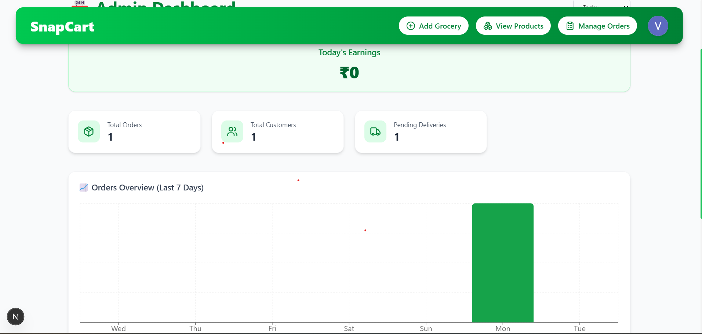
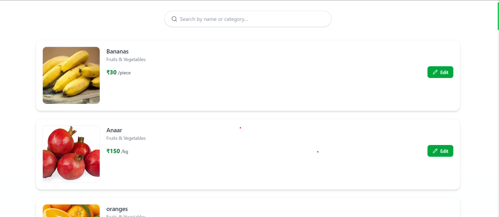
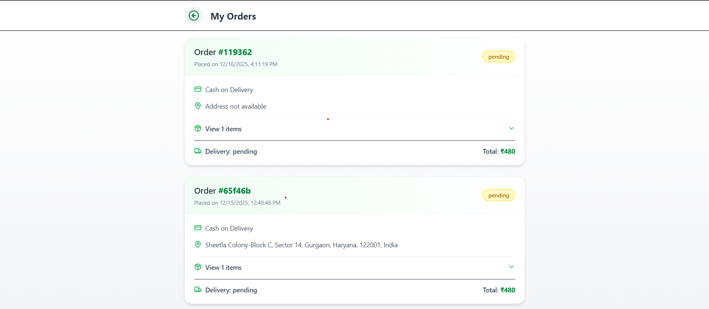
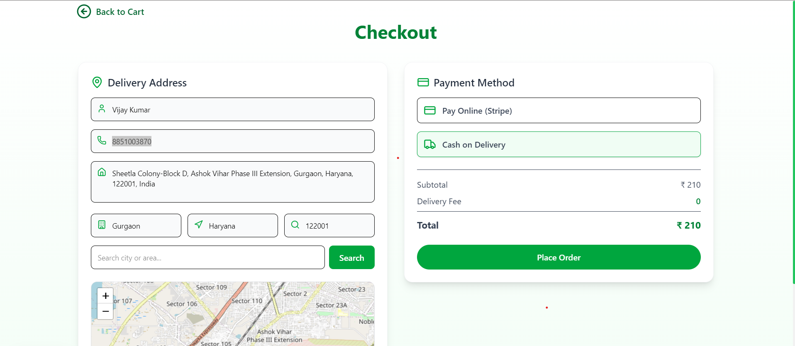

# SnapCart

**One-line description**

A production-grade full-stack Next.js application for grocery ordering and fulfillment, engineered for performance, scale, and security.

## Overview

- End-to-end full-stack application built with Next.js (App Router) and TypeScript, designed for high throughput and maintainability.
- Scalable API surface with clear separation between Server Components, API Routes, and business logic.
- Real-time delivery tracking and messaging with graceful degradation and optimized latency.
- Production-oriented concerns addressed: SSR, image and asset optimization, caching strategies, and observability hooks.
- Developer experience: type-safe code, linting, CI checks, and reproducible builds.

## Tech Stack

- Frontend: **Next.js (App Router)**, **React**, **TypeScript**, **Tailwind CSS**
- Backend: **Next.js API Routes** and **Server Actions** for secure server-side logic
- Database: **MongoDB** or **PostgreSQL** (ORM / ODM: Prisma or Mongoose)
- Authentication: **JWT** and optional **NextAuth** (role-based access control)
- Cloud & DevOps: **Vercel** for hosting, GitHub-based **CI/CD**, environment variables via secure secrets management
- Other: **SWR / React Query** (data fetching patterns), **Zod** or **Yup** (validation), **ESLint**, **Prettier**, and integrations for monitoring (Sentry, Datadog)

## Architecture Overview

The application follows a clear frontend–backend–database flow: client requests are served by Next.js pages and Server Components; interactive logic runs in Client Components and consumes typed APIs exposed via Next.js API Routes or Server Actions. Server-side rendering (SSR) is used for SEO-sensitive pages and initial performance; ISR or client-side fetching is used where freshness or interactivity is required. Sensitive operations and secrets never reach the client — token issuance, validation, and role checks occur exclusively on the server.

Security and performance are integral: request validation, input sanitization, database connection pooling, caching strategies (HTTP cache and CDN), and observability for production debugging and incident response.

## Key Features

- Authentication & Authorization: email/password and provider-based sign-in, JWT/session handling, and role-based access control for admin and delivery roles.
- CRUD operations: products, orders, users, and delivery assignments with transactional integrity where applicable.
- Secure API design: strict input validation, typed request/response shapes, centralized error handling, and least-privilege access patterns.
- Responsive UI: mobile-first, accessible design using Tailwind CSS and progressive enhancement.
- Performance optimizations: SSR for first paint, code-splitting, image optimization, and stale-while-revalidate data strategies.
- Robust error handling: schema validation (Zod/Yup), centralized error middleware, structured logs, and monitoring integrations.

## Screenshots / Demo
### Dashboard


### Order Flow


### my orders( from user view)


### placing order and map( from user view)




Live demo: https://example.vercel.app


## Environment Variables

Create a `.env` or `.env.local` and provide values for the following keys (examples only):

```env
# Database
DATABASE_URL=
MONGODB_URI=
POSTGRES_URL=

# Auth
JWT_SECRET=
NEXTAUTH_URL=
NEXTAUTH_SECRET=

# External services
CLOUDINARY_URL=
SENTRY_DSN=

# App
NEXT_PUBLIC_API_BASE_URL=
```

Security best practices:

- Never commit `.env` files to source control; use encrypted secrets in CI/CD and in hosting provider (Vercel/GitHub Secrets).
- Rotate credentials periodically and apply least-privilege principles to service accounts.

## Installation & Local Setup

1. Clone the repository:

```bash
git clone git@github.com:your-org/snapcart.git
cd snapcart
```

2. Install dependencies

Choose the package manager you prefer (npm, pnpm, or yarn). For reproducible installs in CI, `npm ci` is recommended when using npm.

- Install dependencies for the Next.js app (project root `snapcart`):

```bash
# From repo root
cd snapcart
# npm (recommended for CI):
npm ci
# or npm install
npm install
# or pnpm
pnpm install
# or yarn
yarn install
```

- Install dependencies for the socket server (if you use it locally):

```bash
cd ../socketServer
npm ci
# or pnpm install
# or yarn install
```

- Quick one-line install (PowerShell):

```powershell
Push-Location .\snapcart; npm ci; Pop-Location; Push-Location .\socketServer; npm ci; Pop-Location
```

Notes:

- Node.js 18+ is recommended; confirm your Node and package manager versions before running installs.
- Use the same package manager across the workspace to avoid lockfile conflicts (mixing `package-lock.json`, `pnpm-lock.yaml`, and `yarn.lock` is discouraged).

3. Copy environment variables and fill required secrets:

```bash
cp .env.example .env
# Edit .env with production values and local dev credentials
```

4. Database setup:

- For PostgreSQL (Prisma):

```bash
npx prisma migrate dev
```

- For MongoDB: ensure `MONGODB_URI` is populated and run any provided seed scripts.

5. Run the development server:

```bash
npm run dev
```

Helpful scripts:

- `npm run build` — production build
- `npm run start` — run the production build locally
- `npm run lint` — linting and format checks
- `npm test` — unit and integration tests

## Deployment

Primary target: **Vercel**. Connect the GitHub repository, configure environment variables in the Vercel dashboard, and enable automatic deployments from protected branches (e.g., `main`).

CI/CD pipeline should run linting, type-checks, and tests before allowing deployment. For production readiness, configure cached builds, image domains, route rewrites, and HTTP security headers (HSTS, CSP). Ensure database credentials and connection pooling are suitable for production (use PgBouncer or managed DB pooling for PostgreSQL).

## What Makes This Project Stand Out

- Intentional separation of Server and Client Components using the Next.js App Router for optimal SSR and interactive hydration.
- Type-safe end-to-end contracts (TypeScript + Zod / Prisma), reducing runtime regressions in production.
- Production-grade observability patterns (structured logging, error tracking) and CI gating to maintain code quality and operational stability.
- Designed for scale with caching strategies, background job patterns, and modular domain structure for straightforward feature expansion.

## Future Improvements

- Add horizontally-scalable background workers (Redis + BullMQ) for asynchronous order processing and notifications.
- Introduce contract tests and end-to-end coverage (Playwright/Cypress) for critical user journeys.
- Consider a typed RPC or GraphQL layer (tRPC / GraphQL) to simplify complex client-server interactions.
- Multi-region deployment and advanced CDN edge logic to reduce latency for global users.

## Author

Vishal kumar

- LinkedIn: [https://linkedin.com/in/yourprofile](https://www.linkedin.com/in/vishal-k-94b736262/)
- GitHub: [https://github.com/yourusername](https://github.com/thevishaal26)
